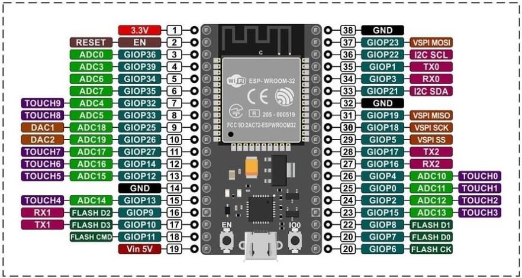

# Manual de Uso y Documentación del Firmware Control Ambiental


## Descripción General

### 1. Introducción
Este manual describe la estructura y el funcionamiento del firmware desarrollado para un ESP32 que mide las lecturas de CO₂, temperatura y humedad, y las envía a una API Flask. Además, el ESP32 actúa como un servidor HTTP local que escucha solicitudes para encender o apagar el extractor según la concentración de CO₂.  

### Componentes:

1. **Sensores:**
   - **MQ135**: Medición de la concentración de gases (CO2, NOx, etc.).
   - **AHT25**: Medición de temperatura y humedad.
   - **Divisor resistivo**: Medicion de la tension de la bateria
   
2. **Actuadores**
   - **Salida a Rele**: Se encarga de manejar el extractor.    

3. **Controlador**
   - **ESP32-S de nodeMCU**: Meneja la logica de recoleccion de los datos y el envio hacia la API, y a su vez es un servidor WiFi que permite escuchar los comandos para accionar el extractor provenientes de la API    

4. **Fuente de alimentacion**
   - **Bateria 9V**: bateria de 9V con regulador de voltaje a 5V. El controlador tiene su propio regulador para alimentarse con 3,3V a partir de la fuente de 5V 


## Estructura del Firmware  
El proyecto está organizado de forma modular para mantener el código limpio y escalable. La estructura es la siguiente:
```CSS
lib/  
    ├── AHT25/  

    │       ├── AHT25Sensor.cpp  
    
    │       ├── AHT25Sensor.h  

    ├── Salidas/  

    │       ├── Extractor.cpp  

    │       ├── Extractor.h   

    ├── DataAPI/  

    │       ├── SensorDataAPI.cpp   

    |       ├── SensorDataAPI.h     

    ├── MQ135/  

    |       ├── MQ135Sensor.cpp     

    |       ├── MQ135Sensor.h     
  
src/  
├── main.cpp├── SensorDataAPI.h   
```  


## Descripción de los Componentes:
- **`AHT25Sensor`**: Controla las lecturas del sensor de temperatura y humedad.  

- **`Extractor`**: Controla el encendido y apagado del extractor a través de un pin GPIO.  

- **`SensorDataAPI`**:
  - Realiza la conexión WiFi.
  - Envía los datos de los sensores a la API Flask.
  - Escucha las órdenes HTTP para el control del extractor.  

- **`MQ135`**: Toma los datos del sensor MQ135 y y hace un filtrado simple

## Estructura del Código  
  
### 1. Inicialización
En el archivo main.cpp, se inicializan los objetos y la conexión WiFi:
```cpp
#include <Arduino.h>
#include <Wire.h>
#include "MQ135Sensor.h"
#include "AHT25Sensor.h"
#include "SensorDataAPI.h"
#include "Extractor.h"
#include "time.h"

// --------------------- Configuración de Pines ---------------------
#define MQ135_PIN 36 // GPIO36 (ADC1_CH0)
#define BATERIA 34 // GPIO34 (ADC1_CH6)
#define EXTRACTOR 12 // GPIO12

// Credenciales WiFi y API
const char* ssid = /*"Fibertel WiFi986 2.4GHz-2.4GHz"*/"Fibertel WiFi032 2.4GHz";
const char* password = /*"00434990126"*/"vuelalto67";
const char* apiEndpoint = "http://localhost:5000/api/lecturas";
const char* apiKey = "adamantium";
const int id_disp = 2;

// Configuración de IP estática
IPAddress ip(192, 168, 0, 100);
IPAddress gateway(192, 168, 0, 1);
IPAddress subnet(255, 255, 255, 0);

// --------------------- Inicialización de Sensores y Periféricos ---------------------
MQ135Sensor mq135(MQ135_PIN);
AHT25Sensor aht25;
Extractor extractor(EXTRACTOR);
//Control_bat bateria(BATERIA);

int triggerAPI = 0;

// Instancia de la clase SensorDataAPI
SensorDataAPI sensorAPI(ssid, password, apiEndpoint, apiKey, extractor, ip, gateway, subnet);

// --------------------- Configuración Inicial ---------------------
void setup() {
    Serial.begin(115200);
    while (!Serial);
    // Conectar a la red WiFi
    sensorAPI.conectarWiFi();
    
    Wire.begin();
    
    // Inicializar sensores y perifericos
    mq135.begin();
    aht25.begin();

   }
```  
- **WiFi:** Se establece una conexión a la red con IP estática para que la API siempre pueda encontrar al ESP32 en la misma dirección.  
- **Configuracion de pines**: Se configuran los pines GPIO donde estará conectado cada sensor y el extractor.

#### **Configuración de Pines:**   
A continuacion se muestra un diagrama con la distribucion de pines en el modulo ESP32-Wroom de **Nodemcu**
  
<center></center>    

**Asignacion**   

- **MQ135** (sensor analógico): Pin ADC0 (GIOP36, pata 3)   
- **bateria** (sensor analogico): Pin ADC6 (GIOP34, pata 6)
- **Extractor**: Pin GIOP12 / pata 13
- **Dispositivos I2C**: Pin I2C SDA / pata 33 y Pin I2C SCL / 36  
  
  
### 2. Envío de Datos hacia la API  

En cada ciclo del loop(), se obtienen las lecturas de los sensores y se envían a la API Flask mediante una solicitud HTTP POST.   

```cpp
void loop() {
    // Lectura de Sensores
    float mq135Data = mq135.readFilteredData();
    float ahtTemp, ahtHumidity;
    aht25.readData(ahtTemp, ahtHumidity);
    float nivel_bat = (analogRead(BATERIA) / 4095.0) * 3.3 * 2;

    //Pasaron 60 segundos?
    if (triggerAPI == 60){
        triggerAPI = 0;
        Serial.println("Procedemos a enviar las lecturas a la base de datos!");
        // Enviar datos a la API
        sensorAPI.enviarLecturas(ahtTemp, ahtHumidity, mq135Data, nivel_bat, id_disp);
        Serial.println("Enviaremos nuevas lecturas dentro de 60 segundos.");
    }
    sensorAPI.manejarComandosExtractor();
    delay(1000); // Esperar 1 segundo antes de la siguiente lectura
    triggerAPI ++;
}
```  
### Funcionamiento del Envío de Datos  
El método `enviarLecturas` en la clase `SensorDataAPI` construye un JSON con los datos y realiza una solicitud HTTP POST al servidor Flask.  
```cpp  
void SensorDataAPI::enviarLecturas(float co2, float temperatura, float humedad, float nivelBateria, int id_disp) {
    HTTPClient http;
    http.begin(ruta);  // Cambia la IP según tu servidor

    http.addHeader("Content-Type", "application/json");
    http.addHeader("X-API-KEY", apikey);

    String postData = "{\"dispositivo_id\": "+ String(id_disp) +", \"co2_ppm\": " + String(co2) +
                      ", \"temperatura\": " + String(temperatura) +
                      ", \"humedad\": " + String(humedad) +
                      ", \"nivel_bateria\": " + String(nivelBateria) + "}";

    int httpResponseCode = http.POST(postData);

    if (httpResponseCode > 0) {
        String response = http.getString();
        Serial.println("Respuesta del servidor: " + response);
    } else {
        Serial.println("Error al enviar datos: " + String(httpResponseCode));
    }

    http.end();
}
```  
### 4. Servidor HTTP Local para el Control del Extractor  

El **ESP32** también funciona como un **servidor HTTP local** que escucha las órdenes de encendido y apagado del extractor. La API Flask envía las órdenes en forma de solicitudes GET hacia las rutas:

- **Encender el extractor**: `/control_extractor?accion=ENCENDER`
- **Apagar el extractor**: `/control_extractor?accion=APAGAR`  
```cpp  
void SensorDataAPI::manejarComandosExtractor() {

    WiFiClient client = server.available();
    if (client) {
        String request = client.readStringUntil('\r');
        client.flush();

        if (request.indexOf("/control_extractor?accion=ENCENDER") != -1) {
            extractor.encender();
            client.println("HTTP/1.1 200 OK\r\n\r\nExtractor encendido");
        } else if (request.indexOf("/control_extractor?accion=APAGAR") != -1) {
            extractor.apagar();
            client.println("HTTP/1.1 200 OK\r\n\r\nExtractor apagado");
        }
    }
}
```  
#### Funcionamiento:  
1- **API Flask detecta concentración alta de CO₂:**
Si el nivel de CO₂ supera el umbral configurado, la API envía una solicitud HTTP al ESP32 para encender el extractor.  
2- **ESP32 recibe la orden:**
El ESP32 escucha en la ruta /control_extractor y, según la acción especificada en la solicitud, enciende o apaga el extractor.

## Posibles mejoras o agregados
Elegimos hacer el control del extractor por medio de un servidor que recibe una orden de la API a modo de demostrar la programacion del mismo, pero la logica de manejo del extraactor podria tratarse directamente en el controlador sin mayores esfuerzos, incluyendo en el codigo las siguientes lineas:  
```cpp  
    if (nivelCO2 > umbral_sup_CO2) {
    digitalWrite(pinExtractor, HIGH);  // Encender extractor
    Serial.println("Extractor encendido por CO2 alto");
  } else {
      if (nivelCO2 > umbral_inf_CO2){
        digitalWrite(pinExtractor, LOW);  // Apagar extractor
        Serial.println("Extractor apagado, CO2 en nivel normal");
      }
  }
```  
Este ultimo fragmento de codigo genera una genera una ventana de trabajo para el extractor donde se encendera si el nivel de CO2 supera un umbral superior y solo se apagara cuando el nivel ce CO2 sea inferior al un umbral inferior.
  
### 5. Conclusión  

Este firmware permite:

- Envío de datos de sensores a la API Flask para registrar niveles de CO₂, temperatura y humedad.  

- Control remoto del extractor a través de órdenes HTTP enviadas desde la API Flask.  

- Conexión WiFi con IP estática, asegurando que el ESP32 esté siempre accesible en la red.  

Con este enfoque modular y funcional, el sistema es robusto y escalable, permitiendo futuras mejoras sin grandes modificaciones al código.  


## Licencia

Este proyecto está licenciado bajo la Licencia Creative Commons Atribución-NoComercial (CC BY-NC). Esta licencia permite que otros remixen, adapten y construyan sobre el trabajo de forma no comercial y, aunque sus nuevos trabajos deben también reconocer al autor original y ser no comerciales, no tienen que licenciar sus obras derivadas en los mismos términos.

Esta licencia es adecuada para un uso educativo y de aprendizaje, permitiendo la libre distribución y utilización del material mientras se protege contra el uso comercial sin autorización previa. Para usos comerciales, es necesario contactar a los autores para obtener permiso.

Para obtener más información sobre esta licencia y ver una copia completa de sus términos, visite [Creative Commons Atribución-NoComercial (CC BY-NC)](https://creativecommons.org/licenses/by-nc/4.0/).